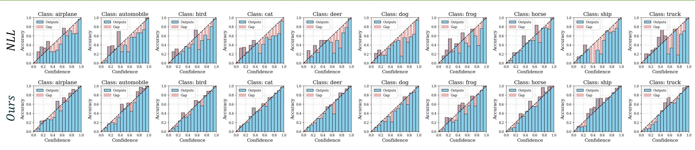

# MDCA Calibration

This is the official PyTorch implementation for the paper: "A Stitch in Time Saves Nine: A Train-Time Regularizing Loss for Improved Neural Network Calibration".
## Abstract
Deep Neural Networks (DNNs) make overconfident mistakes which can prove to be probematic in deployment in safety critical applications. Calibration is aimed to enhance trust in DNNs. The goal of our proposed Multi-Class Difference in Confidence and Accuracy (MDCA) loss is to align the probability estimates in accordance with accuracy thereby enhancing the trust in DNN decisions. MDCA can be used in case of image classification, image segmentation, and natural language classification tasks.



Above image shows comparison of classwise reliability diagrams of Cross-Entropy vs. our proposed method.

## Requirements

* Python 3.8
* PyTorch 1.8

## Training scripts:

Refer to the `scripts` folder to train for every model and dataset. Overall the command to train looks like below where each argument can be changed accordingly on how to train. Also refer to `dataset/__init__.py` and `models/__init__.py` for correct arguments to train with. Argument parser can be found in `utils/argparser.py`.

Train with cross-entropy:
```
python train.py --dataset cifar10 --model resnet56 --schedule-steps 80 120 --epochs 160 --loss cross_entropy 
```

Train with FL+MDCA: Also mention the gamma (for Focal Loss) and beta (Weight assigned to MDCA) to train FL+MDCA with
```
python train.py --dataset cifar10 --model resnet56 --schedule-steps 80 120 --epochs 160 --loss FL+MDCA --gamma 1.0 --beta 1.0 
```

Train with NLL+MDCA:
```
python train.py --dataset cifar10 --model resnet56 --schedule-steps 80 120 --epochs 160 --loss NLL+MDCA --beta 1.0
```

## Post Hoc Calibration:

To do post-hoc calibration, we can use the following command.

`lr` and `patience` value is used for Dirichlet calibration. To change range of grid-search in dirichlet calibration, refer to `posthoc_calibrate.py`.
```
python posthoc_calibrate.py --dataset cifar10 --model resnet56 --lr 0.001 --patience 5 --checkpoint path/to/your/trained/model
```

## Other Experiments (Dataset Drift, Dataset Imbalance):

`experiments` folder contains our experiments on PACS, Rotated MNIST and Imbalanced CIFAR10. Please refer to the scripts provided to run them.

## Citation

If you find our work useful in your research, please cite the following:
```bibtex
@InProceedings{,
    author    = {},
    title     = {A Stitch in Time Saves Nine: A Train-Time Regularizing Loss for Improved Neural Network Calibration},
    booktitle = {Proceedings of the IEEE/CVF Conference on Computer Vision and Pattern Recognition (CVPR)},
    month     = {},
    year      = {}
}
```

## Contact
For questions about our paper or code, please contact any of the authors ([@neelabh17](https://github.com/neelabh17), [@bicycleman15](https://github.com/bicycleman15), [@rhebbalaguppe](https://github.com/rhebbalaguppe) ) or raise an issue on GitHub.

## References:
The code is adapted from the following repositories:

[1] <a href="https://github.com/bearpaw/pytorch-classification">bearpaw/pytorch-classification</a>
[2] <a href="https://github.com/torrvision/focal_calibration">torrvision/focal_calibration</a>
[3] <a href="https://github.com/Jonathan-Pearce/calibration_library">Jonathan-Pearce/calibration_library</a>
